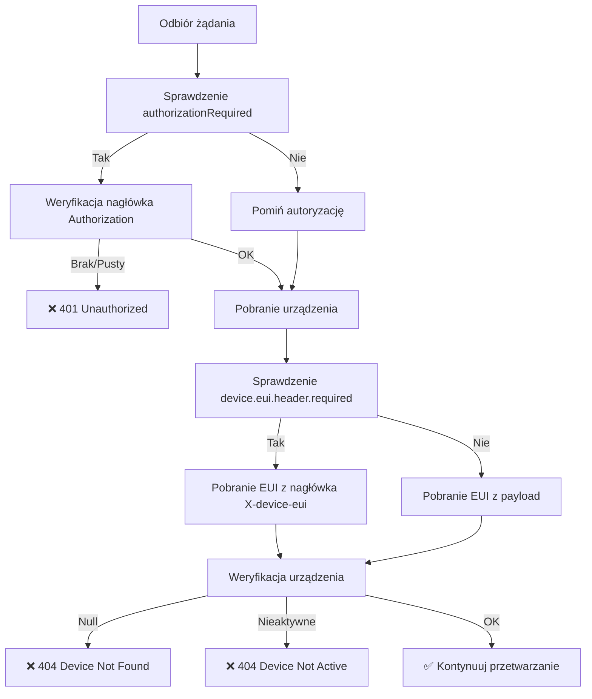
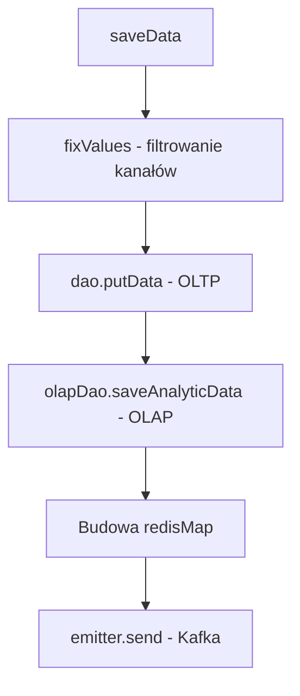
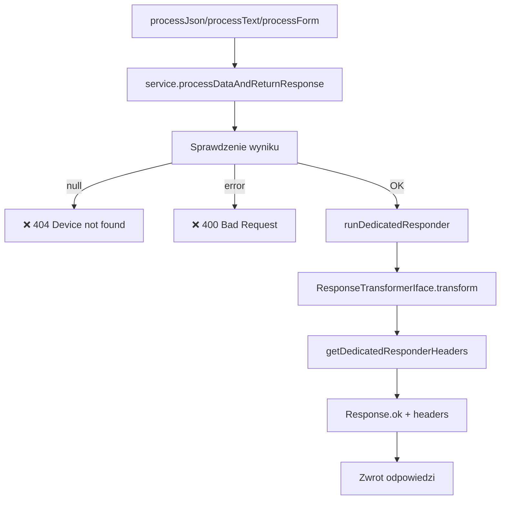
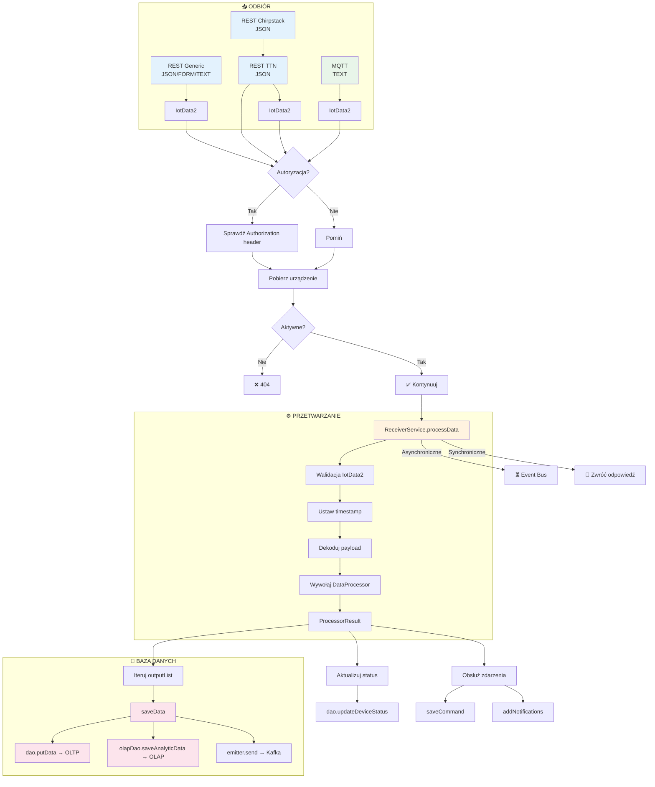
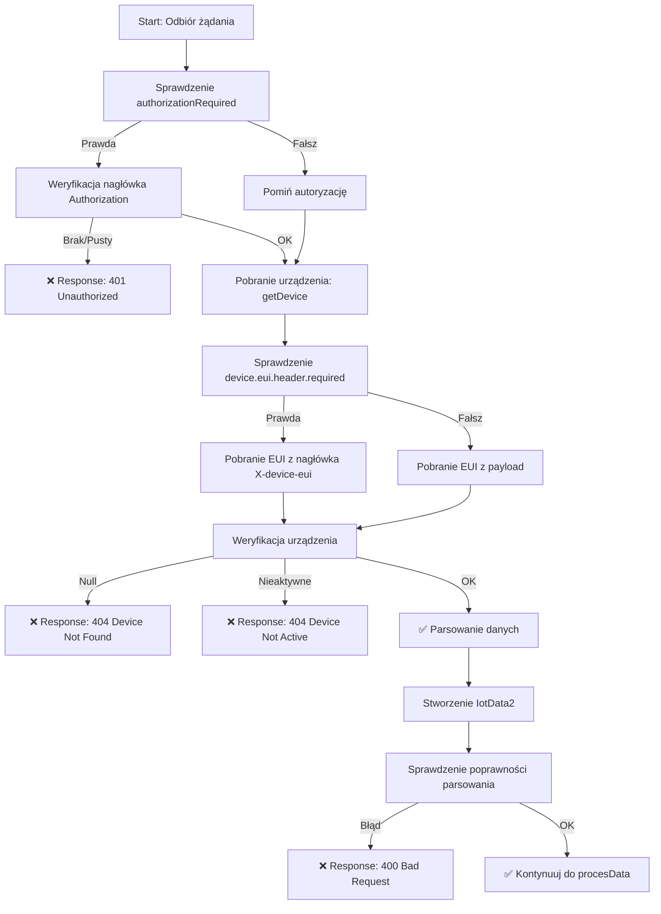

# Analiza Algorytmu Przetwarzania Danych IoT

> **Data analizy:** 2026-07-08  
> **System:** signomix-ta-receiver  
> **Wersja:** 1.0.0 (komit b02d623)  
> **Autor:** Mistral Vibe

---

## Spis Treści

1. [Wprowadzenie](#1-wprowadzenie)
2. [Architektura Systemu](#2-architektura-systemu)
3. [Warstwa Odbioru - Adapter In](#3-warstwa-odbioru---adapter-in)
4. [Algorytm Walidacji i Autoryzacji](#4-algorytm-walidacji-i-autoryzacji)
5. [Routing i Dyspatching](#5-routing-i-dyspatching)
6. [Główne Przetwarzanie - ReceiverService](#6-główne-przetwarzanie---receiverservice)
7. [Data Processor](#7-data-processor)
8. [Zapis do Bazy Danych](#8-zapis-do-bazy-danych)
9. [Obsługa Zdarzeń](#9-obsługa-zdarzeń)
10. [Zwrot Odpowiedzi](#10-zwrot-odpowiedzi)
11. [Diagramy Mermaid](#11-diagramy-mermaid)
12. [Podsumowanie Techniczne](#12-podsumowanie-techniczne)
13. [Wnioski i Rekomendacje](#13-wnioski-i-rekomendacje)

---

## 1. Wprowadzenie

Dokument zawiera **kompleksową analizę algorytmu przetwarzania danych odbieranych od urządzeń IoT** przez REST API w systemie **signomix-ta-receiver**. Analiza obejmuje pełną ścieżkę przetwarzania od warstwy odbioru (pakiet `com.signomix.receiver.adapter.in`), poprzez przetwarzanie w `ReceiverService` i `DataProcessor`, aż do zapisu w bazie danych.

**Cel dokumentu:**
- Zrozumienie mechanizmu odbioru i przetwarzania danych IoT
- Identyfikacja punktów wejścia i formatów danych
- Analiza logiki biznesowej i przetwarzania
- Zrozumienie mechanizmu zapisu do bazy danych
- Dokumentacja przepływu danych w formie diagramów Mermaid

---

## 2. Architektura Systemu

### Model Architektury

System implementuje **Hexagonal Architecture** (Ports & Adapters) z następującymi warstwami:

```
┌─────────────────────────────────────────────────────────────┐
│                        APPLICATION LAYER                         │
│  ┌─────────────────┐    ┌─────────────────┐    ┌─────────────┐ │
│  │ ReceiverService  │    │ BulkDataLoader   │    │  Scripting   │ │
│  │ (Główna logika)  │    │ (Bulk loading)   │    │  Adapter     │ │
│  └─────────────────┘    └─────────────────┘    └─────────────┘ │
├─────────────────────────────────────────────────────────────┤
│                      ADAPTER LAYER                               │
│  ┌─────────────────────────────────────────────────────────┐ │
│  │                    ADAPTER IN                               │ │
│  │  ┌──────────────┐ ┌──────────────┐ ┌──────────────┐     │ │
│  │  │ReceiverResource│ │ChirpstackRest │ │ReceiverResource│     │ │
│  │  │     Generic    │ │   Adapter    │ │       Ttn      │     │ │
│  │  └──────────────┘ └──────────────┘ └──────────────┘     │ │
│  │  ┌──────────────┐                                              │ │
│  │  │  MqttClient   │                                              │ │
│  │  └──────────────┘                                              │ │
│  └─────────────────────────────────────────────────────────┘ │
├─────────────────────────────────────────────────────────────┤
│                      INFRASTRUCTURE LAYER                        │
│  ┌──────────────┐ ┌──────────────┐ ┌──────────────┐               │
│  │  PostgreSQL   │ │  TimescaleDB  │ │    Kafka      │               │
│  │   (OLTP)      │ │   (OLAP)      │ │  (Event Bus)  │               │
│  └──────────────┘ └──────────────┘ └──────────────┘               │
└─────────────────────────────────────────────────────────────┘
```

### Główne Komponenty

| Komponent | Rola | Lokalizacja |
|-----------|------|-------------|
| `ReceiverResourceGeneric` | REST API - Generic | `com.signomix.receiver.adapter.in` |
| `ChirpstackRestAdapter` | REST API - ChirpStack | `com.signomix.receiver.adapter.in` |
| `ReceiverResourceTtn` | REST API - TTN v3 | `com.signomix.receiver.adapter.in` |
| `MqttClient` | MQTT Subscriber | `com.signomix.receiver.adapter.in` |
| `ReceiverService` | Główna logika przetwarzania | `com.signomix.receiver` |
| `DataProcessorIface` | Interfejs procesora | `com.signomix.receiver.processor` |
| `NashornDataProcessor` | Procesor JavaScript | `com.signomix.receiver.processor` |
| `DefaultProcessor` | Domyślny procesor | `com.signomix.receiver.processor` |
| `IotDatabaseDao` | DAO - OLTP | `com.signomix.common.tsdb` |
| `IotDatabaseDao` | DAO - OLAP | `com.signomix.common.tsdb` |

### Technologie

- **Język:** Java 17+
- **Framework:** Quarkus
- **Reactive:** Vert.x Event Bus
- **Bazy danych:** PostgreSQL (OLTP), TimescaleDB (OLAP)
- **Messaging:** Kafka, MQTT
- **Skryptowanie:** Nashorn JavaScript Engine
- **Konfiguracja:** MicroProfile Config

---

## 3. Warstwa Odbioru - Adapter In

### Pakiet `com.signomix.receiver.adapter.in`

Warstwa **Adapter In** odpowiada za **odbiór danych od urządzeń IoT** przez różne protokoły. System obsługuje **4 główne mechanizmy odbioru**:

### 3.1. Porównanie Mechanizmów Odbioru

| Klasa | Protokoł | Typ Danych | Ścieżka API | Format Wejściowy | Format Wyjściowy | Mechanizm Odpowiedzi |
|-------|----------|------------|-------------|------------------|------------------|---------------------|
| `ReceiverResourceGeneric` | HTTP REST | Generic | `/api/receiver/io`, `/api/receiver/in` | JSON, TEXT, FORM-URL-ENCODED, MULTIPART | `IotData2` | Synchroniczna odpowiedź |
| `ChirpstackRestAdapter` | HTTP REST | ChirpStack | `/api/receiver/chirpstack` | JSON (ChirpstackUplink) | `IotData2` | Asynchroniczne (Event Bus) |
| `ReceiverResourceTtn` | HTTP REST | TTN v3 | `/api/receiver/ttn3/up` | JSON (TtnData3) | `IotData2` | Asynchroniczne (Event Bus) |
| `MqttClient` | MQTT | Generic | Topic: `data` | TEXT (CSV) | `IotData2` | Asynchroniczne (Bezpośrednie) |

### 3.2. Szczegóły Implementacji

#### ReceiverResourceGeneric

**Funkcjonalność:** Unwersalny endpoint dla dowolnych urządzeń IoT.

**Endpointy:**
- `POST /api/receiver/io` - Obsługa JSON, TEXT, FORM
- `POST /api/receiver/in` - Alternatywne endpointy
- `POST /api/receiver/bulk` - Masowe przesyłanie CSV (MULTIPART)
- `POST /api/receiver/edge` - Przetwarzanie batch CSV

**Metody parsowania:**
- `parseJson()` - Konwersja `IotDto` → `IotData2`
- `parseTextData()` - Parsowanie TEXT z separatorem
- `parseFormData()` - Parsowanie formularza HTML
- `runDedicatedParser()` - Użycie custom parsera (jeśli zdefiniowany)

**Przykład parsowania JSON:**
```java
private IotData2 parseJson(String eui, boolean authRequired, 
                          String authKey, IotDto dataObject) {
    long systemTimestamp = System.currentTimeMillis();
    IotData2 data = new IotData2();
    data.dev_eui = eui;
    if (null != dataObject.dev_eui && !dataObject.dev_eui.isEmpty()) {
        data.dev_eui = dataObject.dev_eui;
    }
    data.gateway_eui = dataObject.gateway_eui;
    data.timestamp = "" + dataObject.timestamp;
    data.clientname = dataObject.clientname;
    data.payload = dataObject.payload;
    data.hexPayload = dataObject.hex_payload;
    data.payload_fields = dataObject.payload_fields;
    data.normalize();
    data.setTimestampUTC(systemTimestamp);
    data.authKey = authKey;
    data.authRequired = authRequired;
    return data;
}
```

#### ChirpstackRestAdapter

**Funkcjonalność:** Integracja z LoRaWAN Network Server (ChirpStack).

**Endpoint:**
- `POST /api/receiver/chirpstack?event=up` - Odbiór uplinków
- `POST /api/receiver/chirpstack?event=join` - Odbiór join (niezaimplementowane)

**Przetwarzanie:**
1. Deserializacja JSON do `ChirpstackUplink`
2. Transformacja do `IotData2`
3. Wysłanie na Event Bus (`chirpstackdata-no-response`)

**Przykład transformacji:**
```java
private IotData2 transform(ChirpstackUplink uplink, String authKey, 
                          boolean authorizationRequired) {
    long systemTimestamp = System.currentTimeMillis();
    IotData2 data = new IotData2();
    
    data.dev_eui = uplink.deviceinfo.devEui;
    data.timestamp = uplink.time; // lub system time w trybie dev/test
    data.counter = uplink.fCnt;
    data.port = uplink.fPort;
    data.time = data.timestamp;
    
    // Parsowanie timestamp
    OffsetDateTime odt = OffsetDateTime.parse(data.timestamp);
    data.timestampUTC = Timestamp.from(odt.toInstant());
    
    // Konwersja payload_fields z objectJSON
    if (null != uplink.objectJSON && !uplink.objectJSON.isEmpty()) {
        HashMap pfMap = mapper.readValue(uplink.objectJSON, HashMap.class);
        // Konwersja do listy ChannelData
        convertToChannelData(pfMap, data.payload_fields);
    }
    
    data.normalize();
    data.chirpstackUplink = uplink;
    return data;
}
```

#### ReceiverResourceTtn

**Funkcjonalność:** Integracja z The Things Network v3.

**Endpoint:**
- `POST /api/receiver/ttn3/up` - Odbiór uplinków

**Przetwarzanie:**
1. Dekodowanie JSON przez `com.signomix.common.iot.tts.Decoder`
2. Transformacja `TtnData3` → `IotData2`
3. Wysłanie na Event Bus (`ttndata-no-response`)

**Przykład transformacji:**
```java
private IotData2 transform(TtnData3 dataObject, String authKey, 
                          boolean authRequired) {
    long systemTimestamp = System.currentTimeMillis();
    IotData2 data = new IotData2(systemTimestamp);
    
    data.dev_eui = dataObject.deviceEui;
    data.timestamp = "" + dataObject.getTimestamp();
    data.port = dataObject.getPort();
    data.counter = dataObject.getFrameCounter();
    data.timestampUTC = new Timestamp(dataObject.timestamp);
    
    // Konwersja payload_fields
    HashMap pfMap = dataObject.getPayloadFields();
    Iterator<String> it = pfMap.keySet().iterator();
    while (it.hasNext()) {
        String key = it.next();
        Object value = pfMap.get(key);
        HashMap<String, Object> tempMap = new HashMap<>();
        tempMap.put("name", key.toLowerCase());
        
        // Konwersja typów
        if (value instanceof Number) {
            tempMap.put("value", ((Number) value).doubleValue());
        } else if (value instanceof Boolean) {
            tempMap.put("value", ((Boolean) value) ? 1.0 : 0.0);
        } else if (value instanceof String) {
            tempMap.put("value", value);
        }
        
        data.payload_fields.add(tempMap);
    }
    
    data.normalize();
    return data;
}
```

#### MqttClient

**Funkcjonalność:** Odbiór danych przez protokół MQTT.

**Konfiguracja:**
- Topic: `data` (konfigurowany przez `@Incoming("data")`)
- Format: TEXT (CSV)

**Przetwarzanie:**
```java
@Incoming("data")
public void processData(byte[] bytes) {
    String msg = new String(bytes);
    logger.info("Data received: " + msg);
    
    IotData2 iotData = parseTextData(msg, ";");
    Device device = service.getDevice(iotData.dev_eui);
    
    if (null == device) {
        logger.warn("unknown device " + iotData.dev_eui);
        return;
    }
    
    if (!device.isActive()) {
        return;
    }
    
    service.processDataNoResponse(iotData);
}
```

---

## 4. Algorytm Walidacji i Autoryzacji

### 4.1. Schemat Walidacji



### 4.2. Implementacja Walidacji

**Konfiguracje:**
```java
@ConfigProperty(name = "device.authorization.required")
Boolean authorizationRequired;

@ConfigProperty(name = "device.eui.header.required")
Boolean euiHeaderFirst;
```

**Algorytm w ReceiverResourceGeneric:**
```java
// Walidacja autoryzacji
if (authorizationRequired && (null == authKey || authKey.isBlank())) {
    return Response.status(Status.UNAUTHORIZED)
        .entity("no authorization header fond")
        .build();
}

// Walidacja urządzenia (jeśli EUI w nagłówku)
Device device = null;
if (euiHeaderFirst) {
    device = service.getDevice(inHeaderEui);
    if (null == device) {
        LOG.warn("unknown device " + inHeaderEui);
        return Response.status(Status.NOT_FOUND)
            .entity("device not found")
            .build();
    }
    if (!device.isActive()) {
        return Response.status(Status.NOT_FOUND)
            .entity("device is not active")
            .build();
    }
}

// Parsowanie danych
IotData2 iotData = parseJson(inHeaderEui, authorizationRequired, authKey, dataObject);

// Walidacja urządzenia (jeśli EUI w payload)
if (!euiHeaderFirst) {
    device = service.getDevice(iotData.dev_eui);
    if (null == device) {
        LOG.warn("unknown device " + iotData.dev_eui);
        return Response.status(Status.NOT_FOUND)
            .entity("device not found")
            .build();
    }
    if (!device.isActive()) {
        return Response.status(Status.NOT_FOUND)
            .entity("device is not active")
            .build();
    }
}
```

### 4.3. Walidacja w ReceiverService

**Metoda `getDeviceChecked`:**
```java
public Device getDeviceChecked(IotData2 data, DeviceType[] expectedTypes) {
    return getDeviceChecked(
        data.getDeviceEUI(),
        data.getAuthKey(),
        data.authRequired,
        expectedTypes
    );
}

private Device getDeviceChecked(
    String eui,
    String authKey,
    boolean authRequired,
    DeviceType[] expectedTypes
) {
    // 1. Pobranie urządzenia
    Device device = getDevice(eui);
    if (null == device) {
        LOG.warn("Device " + eui + " is not registered");
        return null;
    }
    
    // 2. Walidacja autoryzacji
    if (authRequired) {
        String secret = device.getKey();
        try {
            if (null == authKey || !authKey.equals(secret)) {
                LOG.warn("Authorization key don't match for " + device.getEUI());
                return null;
            }
        } catch (Exception ex) {
            LOG.warn(ex.getMessage());
            return null;
        }
    }
    
    // 3. Walidacja typu urządzenia
    boolean deviceFound = false;
    for (DeviceType expected : expectedTypes) {
        if (expected == DeviceType.valueOf(device.getType())) {
            deviceFound = true;
            break;
        }
    }
    if (!deviceFound) {
        LOG.warn("Device " + eui + " type is not valid");
        return null;
    }
    
    // 4. Walidacja aktywności
    if (!device.isActive()) {
        return null;
    }
    
    // 5. Sprawdzenie ochrony danych (opcjonalne)
    if (useProtectedFeature) {
        try {
            String tagValue = dao.getDeviceTagValue(device.getEUI(), "protected");
            device.setDataProtected(Boolean.parseBoolean(tagValue));
        } catch (IotDatabaseException e) {
            LOG.error(e.getMessage());
        }
    }
    
    return device;
}
```

---

## 5. Routing i Dyspatching

### 5.1. Mechanizmy Routingu

| Typ Żądania | Ścieżka | Metoda | Mechanizm | Odpowiedź |
|-------------|---------|--------|-----------|-----------|
| Synchroniczne REST | `ReceiverResourceGeneric` | `processDataAndReturnResponse()` | Bezpośrednie wywołanie | HTTP Response |
| Asynchroniczne REST | `ChirpstackRestAdapter`, `ReceiverResourceTtn` | `bus.send()` | Event Bus | HTTP 200 OK |
| MQTT | `MqttClient` | `processDataNoResponse()` | Bezpośrednie wywołanie | Brak |

### 5.2. Event Bus Topics

System wykorzystuje **Vert.x Event Bus** do asynchronicznej komunikacji:

| Topic | Opis | Konsument |
|-------|------|-----------|
| `iotdata-no-response` | Dane generyczne | `ReceiverService.processDataNoResponse()` |
| `ttndata-no-response` | Dane TTN | `ReceiverService.processTtnData()` |
| `chirpstackdata-no-response` | Dane ChirpStack | `ReceiverService.processChirpstackData()` |
| `virtualdata-no-response` | Dane wirtualne | `ReceiverService.processVirtualData()` |

**Rejestracja codeców:**
```java
public void onApplicationStart(@Observes StartupEvent event) {
    try {
        bus.registerCodec(new IotDataMessageCodec());
    } catch (Exception e) {}
}
```

**Wysyłanie na Event Bus:**
```java
private void send(IotData2 iotData) {
    IotDataMessageCodec iotDataCodec = new IotDataMessageCodec();
    DeliveryOptions options = new DeliveryOptions().setCodecName(iotDataCodec.name());
    bus.send("iotdata-no-response", iotData, options);
    LOG.debug("sent");
}
```

**Odbiór z Event Bus:**
```java
@ConsumeEvent(value = "iotdata-no-response")
public void processDataNoResponse(IotData2 data) {
    processData(data);
}

@ConsumeEvent(value = "ttndata-no-response")
void processTtnData(IotData2 data) {
    processData(data);
}

@ConsumeEvent(value = "chirpstackdata-no-response")
void processChirpstackData(IotData2 data) {
    try {
        processData(data);
    } catch (Exception e) {
        LOG.error("Error processing Chirpstack data: " + e.getMessage());
        e.printStackTrace();
    }
}
```

### 5.3. Codec IotDataMessageCodec

Custom codec dla serializacji/deserializacji `IotData2` na Event Bus.

---

## 6. Główne Przetwarzanie - ReceiverService

### 6.1. Główna Metoda `processData(IotData2 data)`

**Algorytm:**

```mermaid
flowchart TD
    A[processData] --> B[Walidacja IotData2]
    B --> C[Pobranie urządzenia: getDeviceChecked]
    C --> D[Sprawdzenie frame counter (LoRa)]
    D --> E[Sprawdzenie błędów parsera]
    E --> F[Ustawienie timestampUTC]
    F --> G[prepareIotValues]
    G --> H[Pobranie Application]
    H --> I[decodePayload → ArrayList<ChannelData>]
    I --> J[Wywołanie DataProcessor: callProcessorService]
    J --> K[ProcessorResult]
    K --> L[Iteracja po outputList]
    L --> M[saveData(device, list)]
    K --> N[Sprawdzenie typu urządzenia]
    N -->|VIRTUAL| O[saveVirtualData]
    K --> P[Aktualizacja statusu urządzenia]
    K --> Q[Obsługa zdarzeń: events, dataEvents]
```

**Implementacja:**
```java
private String processData(IotData2 data) {
    // 1. Walidacja podstawowa
    if (data == null) {
        LOG.warn("processData called with null data");
        return null;
    }
    if (data.payload_fields == null) {
        data.payload_fields = new ArrayList<>();
    }
    
    // 2. Logowanie
    LOG.info("DATA FROM EUI: " + data.getDeviceEUI());
    long systemTimestamp = System.currentTimeMillis();
    
    // 3. Pobranie i walidacja urządzenia
    DeviceType[] expected = {DeviceType.GENERIC, DeviceType.VIRTUAL, 
                            DeviceType.TTN, DeviceType.CHIRPSTACK, DeviceType.LORA};
    Device device = getDeviceChecked(data, expected);
    if (null == device) {
        return null;
    }
    
    // 4. Sprawdzenie frame counter (dla LoRa)
    if (device.isCheckFrames() && 
        (device.getType() == DeviceType.TTN.name() ||
         device.getType() == DeviceType.CHIRPSTACK.name() ||
         device.getType() == DeviceType.LORA.name())) {
        checkFrameCounter(device, data.counter);
    }
    
    // 5. Sprawdzenie błędów parsera
    String parserError = getFirstParserErrorValue(data);
    if (null != parserError && !parserError.isEmpty()) {
        return "ERROR: " + parserError;
    }
    
    // 6. Ustawienie timestamp
    data.setTimestampUTC(systemTimestamp);
    data.prepareIotValues(systemTimestamp);
    
    // 7. Pobranie aplikacji
    Application app = getApplication(device.getOrgApplicationId());
    
    // 8. Dekodowanie payload
    ArrayList<ChannelData> inputList = decodePayload(data, device, app);
    
    // 9. Wywołanie DataProcessor
    ProcessorResult scriptResult = null;
    try {
        scriptResult = callProcessorService(inputList, device, app, data, null);
        if (null == scriptResult) {
            scriptResult = getProcessingResult(inputList, device, app, data, null);
        }
    } catch (Exception e) {
        LOG.error(e.getMessage());
    }
    
    // 10. Zapis danych
    if (scriptResult != null && scriptResult.getOutput() != null) {
        ArrayList<ArrayList> outputList = scriptResult.getOutput();
        for (int i = 0; i < outputList.size(); i++) {
            saveData(device, outputList.get(i));
        }
    }
    
    // 11. Obsługa urządzeń wirtualnych
    if (DeviceType.VIRTUAL.name().equals(device.getType())) {
        saveVirtualData(device, data);
    }
    
    // 12. Aktualizacja statusu
    updateDeviceOrHealthStatus(device, scriptResult);
    
    // 13. Obsługa zdarzeń
    processEvents(device, scriptResult);
    
    return getResponseForDevice(device, scriptResult);
}
```

### 6.2. Sprawdzenie Frame Counter (LoRa)

**Algorytm:**
```java
// Frame counter check
if (device.isCheckFrames() && isLoRaDevice(device)) {
    String deviceKey = device.getEUI();
    long previousFrame = frameCountersMap.getOrDefault(deviceKey, 0L);
    long currentFrame = data.counter;
    long resetLevel = 100L; // TODO: get from device config
    
    if (previousFrame - currentFrame >= resetLevel) {
        previousFrame = 0L; // Reset licznika przy overflow
    }
    
    frameCountersMap.put(device.getEUI(), currentFrame);
    
    if (currentFrame <= previousFrame) {
        LOG.warn("Frame counter error: " + currentFrame + " <= " + previousFrame);
        // Możliwość zwrócenia błędu
    }
}
```

### 6.3. Dekodowanie Payload

**Algorytm `decodePayload`:**

```mermaid
flowchart TD
    A[decodePayload] --> B[Pobranie deviceDecoderScript]
    B --> C{Skrypt istnieje?}
    C -->|Tak| D[Pobranie payload]
    C -->|Nie| E[Użyj danych z payload_fields]
    D --> F{Format payload?}
    F -->|Base64| G[Base64 decode]
    F -->|HEX| H[HEX decode]
    G --> I[byte[]]
    H --> I
    I --> J[scriptingAdapter.decodeData]
    J --> K[ArrayList<ChannelData>]
    E --> L[data.getDataList()]
    K --> M[Połącz z data.getDataList()]
    L --> M
    M --> N[return values]
```

**Implementacja:**
```java
private ArrayList<ChannelData> decodePayload(
    IotData2 data, Device device, Application application
) {
    if (null == device) {
        LOG.warn("device is null");
        return new ArrayList<>();
    }
    
    ArrayList<ChannelData> values = new ArrayList<>();
    byte[] emptyBytes = {};
    byte[] byteArray = null;
    
    // Pobranie skryptu dekodera
    String deviceDecoderScript = device.getEncoderUnescaped();
    if ((null == deviceDecoderScript || deviceDecoderScript.trim().isEmpty()) && 
        null != application) {
        deviceDecoderScript = application.decoder;
    }
    
    // Jeśli istnieje skrypt dekodera
    if (null != deviceDecoderScript && deviceDecoderScript.length() > 0) {
        if (null != data.getPayload()) {
            if (LOG.isDebugEnabled()) {
                LOG.debug("base64Payload: " + data.getPayload());
            }
            byteArray = Base64.getDecoder().decode(data.getPayload().getBytes());
        } else if (null != data.getHexPayload()) {
            if (LOG.isDebugEnabled()) {
                LOG.debug(device.getEUI() + " hexPayload: " + data.getHexPayload());
            }
            byteArray = getByteArray(data.getHexPayload());
        } else {
            byteArray = emptyBytes;
        }
        
        if (null == byteArray) {
            byteArray = emptyBytes;
        }
        
        try {
            values = scriptingAdapter.decodeData(
                byteArray,
                device.getEUI(),
                deviceDecoderScript,
                data.getTimestamp()
            );
        } catch (ScriptAdapterException ex) {
            ex.printStackTrace();
            addNotifications(device, null, ex.getMessage(), false);
            values = new ArrayList<>();
        } catch (Exception e) {
            e.printStackTrace();
            addNotifications(device, null, e.getMessage(), false);
            values = new ArrayList<>();
        }
    }
    
    // Dodanie danych z payload_fields
    if (!data.getDataList().isEmpty()) {
        for (int i = 0; i < data.getDataList().size(); i++) {
            values.add(data.getDataList().get(i));
        }
    }
    
    return values;
}
```

---

## 7. Data Processor

### 7.1. Interfejs DataProcessorIface

```java
public interface DataProcessorIface {
    ProcessorResult getProcessingResult(
        ArrayList<ChannelData> listOfValues,
        Device device,
        Application application,
        long dataTimestamp,
        Double latitude,
        Double longitude,
        Double altitude,
        String requestData,
        String command,
        IotDatabaseIface dao,
        Long port
    ) throws Exception;

    ProcessorResult getProcessingResult(
        ArrayList<ChannelData> listOfValues,
        Device device,
        Application application,
        long dataTimestamp,
        Double latitude,
        Double longitude,
        Double altitude,
        String requestData,
        String command,
        IotDatabaseIface dao,
        Long port,
        ChirpstackUplink chirpstackUplink,
        TtnData3 ttnUplink
    ) throws Exception;
}
```

### 7.2. Implementacje Procesorów

| Procesor | Opis | Zastosowanie |
|----------|------|--------------|
| `NashornDataProcessor` | Wykorzystuje silnik JavaScript (Nashorn) do przetwarzania | Urządzenia ze skryptami JavaScript |
| `DefaultProcessor` | Domyślne przetwarzanie bez skryptów | Urządzenia bez skryptów |

#### NashornDataProcessor

**Zależności:**
```java
@Inject
NashornScriptingAdapter scriptingAdapter;
```

**Implementacja:**
```java
@Override
public ProcessorResult getProcessingResult(
    ArrayList<ChannelData> listOfValues,
    Device device,
    Application application,
    long dataTimestamp,
    Double latitude,
    Double longitude,
    Double altitude,
    String requestData,
    String command,
    IotDatabaseIface dao,
    Long port
) throws Exception {
    ProcessorResult scriptResult = null;
    
    try {
        if (LOG.isDebugEnabled()) {
            LOG.debug("listOfValues.size()==" + listOfValues.size());
        }
        
        scriptResult = scriptingAdapter.processData1(
            listOfValues,
            device,
            application,
            dataTimestamp,
            latitude,
            longitude,
            altitude,
            command,
            requestData,
            dao,
            port
        );
    } catch (ScriptAdapterException e) {
        e.printStackTrace();
        throw new Exception(e.getMessage());
    }
    
    if (scriptResult == null) {
        throw new Exception("preprocessor script returns null result");
    }
    
    return scriptResult;
}
```

#### DefaultProcessor

**Implementacja:**
```java
@Override
public ProcessorResult getProcessingResult(
    ArrayList<ChannelData> listOfValues,
    Device device,
    Application application,
    long dataTimestamp,
    Double latitude,
    Double longitude,
    Double altitude,
    String requestData,
    String command,
    IotDatabaseIface dao,
    Long port,
    ChirpstackUplink chirpstackUplink,
    TtnData3 ttnUplink
) throws Exception {
    int actualParameters = listOfValues.size();
    long spreadingFactor;
    ProcessorResult result = new ProcessorResult();
    
    // Kopiowanie danych wejściowych
    for (ChannelData channelData : listOfValues) {
        if (LOG.isDebugEnabled()) {
            LOG.debug("channel data: " + channelData.getName() + 
                     ", value: " + channelData.getValue() + 
                     ", timestamp: " + channelData.getTimestamp());
        }
        result.putData(
            channelData.getDeviceEUI(),
            channelData.getName(),
            channelData.getValue(),
            channelData.getTimestamp(),
            channelData.getStringValue()
        );
    }
    
    result.setDeviceStatus(device.getState());
    
    // Obsługa danych transmisji LoRa
    if (chirpstackUplink == null && ttnUplink == null) {
        return result;
    }
    
    // Sprawdzenie czy pobierać dane transmisji
    ApplicationConfig appConfig = application != null ? application.config : null;
    HashMap<String, Object> devConfig = device.getConfigurationMap();
    boolean getTransmissionData = false;
    
    if (devConfig.containsKey("processor.getTransmissionData")) {
        getTransmissionData = (Boolean) devConfig.get("processor.getTransmissionData");
    } else if (appConfig != null && appConfig.containsKey("processor.getTransmissionData")) {
        getTransmissionData = Boolean.parseBoolean(
            appConfig.get("processor.getTransmissionData")
        );
    }
    
    if (!getTransmissionData) {
        return result;
    }
    
    // Dodanie danych LoRa
    if (chirpstackUplink != null) {
        long dataRate = chirpstackUplink.dr;
        try {
            spreadingFactor = chirpstackUplink.txInfo.modulation.get("lora").spreadingFactor;
        } catch (Exception e) {
            spreadingFactor = 0;
        }
        
        result.putData(device.getEUI(), "dr", dataRate, dataTimestamp, String.valueOf(dataRate));
        result.putData(device.getEUI(), "sf", spreadingFactor, dataTimestamp, String.valueOf(spreadingFactor));
        
        // Dodanie danych gatewayów
        addGatewayData(result, chirpstackUplink, dataTimestamp, actualParameters);
    } else if (ttnUplink != null) {
        // Podobne przetwarzanie dla TTN
        addTtnGatewayData(result, ttnUplink, dataTimestamp, actualParameters);
    }
    
    return result;
}
```

### 7.3. Wybór Procesora w ReceiverService

**Algorytm `callProcessorService`:**

```mermaid
flowchart TD
    A[callProcessorService] --> B[Pobranie skryptu urządzenia]
    B --> C[clear() - usunięcie białych linii]
    C --> D[getClassName() - pobranie nazwy klasy]
    D --> E{Skrypt pusty?}
    E -->|Tak| F[DefaultProcessor]
    E -->|Nie| G[Sprawdź //class=]
    G --> H{Nazwa klasy znaleziona?}
    H -->|Tak| I[Instantiate processor]
    H -->|Nie| F
    I --> J[Wywołaj getProcessingResult]
    J --> K[ProcessorResult]
    F --> J
    K --> L[Ustaw applicationConfig]
    L --> M[return result]
```

**Implementacja:**
```java
private ProcessorResult callProcessorService(
    ArrayList<ChannelData> inputList,
    Device device,
    Application application,
    IotData2 iotData,
    String dataString
) throws Exception {
    String processorClassName = null;
    String script = clear(device.getCodeUnescaped());
    
    // Sprawdzenie czy skrypt zawiera klasę procesora
    if (!script.isEmpty()) {
        processorClassName = getClassName(script);
    } else if (processorClassName == null && application != null && application.code != null) {
        script = clear(application.code);
    }
    
    DataProcessorIface processor = null;
    if (script.isEmpty()) {
        processor = new DefaultProcessor();
    } else {
        processorClassName = getClassName(script);
        if (processorClassName != null && !processorClassName.isEmpty()) {
            try {
                Class<?> clazz = Class.forName(processorClassName);
                processor = (DataProcessorIface) clazz
                    .getDeclaredConstructor()
                    .newInstance();
            } catch (Exception e) {
                throw new Exception("Failed to instantiate processor: " + processorClassName, e);
            }
        }
    }
    
    if (processor == null) {
        return null;
    }
    
    if (LOG.isDebugEnabled()) {
        LOG.debug("processorClassName: " + processor.getClass().getName());
    }
    
    ProcessorResult result = processor.getProcessingResult(
        inputList,
        device,
        application,
        iotData.getReceivedPackageTimestamp(),
        iotData.getLatitude(),
        iotData.getLongitude(),
        iotData.getAltitude(),
        dataString,
        "",
        olapDao,
        iotData.port,
        iotData.chirpstackUplink,
        iotData.ttnUplink
    );
    
    if (result != null) {
        result.setApplicationConfig(device.getApplicationConfig());
    }
    
    return result;
}

private String getClassName(String deviceScript) {
    String processorClassName = null;
    String[] lines = deviceScript.split("\n");
    for (String line : lines) {
        if (line.trim().isEmpty()) {
            continue;
        }
        if (line.startsWith("//class=")) {
            processorClassName = line.substring(8).trim();
            break;
        }
    }
    return processorClassName;
}
```

---

## 8. Zapis do Bazy Danych

### 8.1. Główna Metoda `saveData`

**Algorytm:**



**Implementacja:**
```java
private void saveData(Device device, ArrayList<ChannelData> list) {
    try {
        if (LOG.isDebugEnabled()) {
            LOG.debug("saveData list.size():" + list.size());
        }
        
        if (null != dao) {
            dao.putData(device, fixValues(device, list));
        }
        
        if (null != olapDao) {
            LOG.debug("saveData to olap DB");
            olapDao.saveAnalyticData(device, list);
        } else {
            LOG.warn("olapDao is null");
        }
        
        // Budowa mapy dla Redis/Kafka
        HashMap<String, Double> redisMap = new HashMap<>();
        list.forEach(cdata -> {
            redisMap.put(cdata.getName(), cdata.getValue());
        });
        
        // Wysłanie na topic "data-received"
        emitter.send(buildDataReceivedMessage(device, list));
    } catch (IotDatabaseException e) {
        e.printStackTrace();
    } catch (Exception e) {
        e.printStackTrace();
    }
}
```

### 8.2. Filtrowanie Kanałów

**Metoda `fixValues`:**
```java
ArrayList<ChannelData> fixValues(Device device, ArrayList<ChannelData> values) {
    ArrayList<ChannelData> fixedList = new ArrayList<>();
    if (values != null && values.size() > 0) {
        for (ChannelData value : values) {
            // Tylko kanały zdefiniowane w konfiguracji urządzenia
            if (device.getChannels().containsKey(value.getName())) {
                fixedList.add(value);
            }
        }
    }
    return fixedList;
}
```

### 8.3. Budowa Wiadomości dla Kafka

**Metoda `buildDataReceivedMessage`:**
```java
private String buildDataReceivedMessage(Device device, ArrayList<ChannelData> list) {
    StringBuilder sb = new StringBuilder();
    
    // Nagłówek: EUI, orgId, name, state, alertStatus, lat, lon, alt
    sb.append(device.getEUI())
        .append(",")
        .append(device.getOrganizationId())
        .append(",")
        .append(device.getName())
        .append(",")
        .append(device.getState())
        .append(",")
        .append(device.getAlertStatus())
        .append(",")
        .append(device.getLatitude())
        .append(",")
        .append(device.getLongitude())
        .append(",")
        .append(device.getAltitude())
        .append(",");
    
    // Dane pomiarowe: timestamp, name=value
    ChannelData cd = list.get(0);
    sb.append(cd.getTimestamp());
    
    for (int i = 0; i < list.size(); i++) {
        cd = list.get(i);
        if (cd.getValue() != null) {
            sb.append(",")
                .append(cd.getName())
                .append("=")
                .append(cd.getValue());
        }
    }
    
    LOG.info("data-received message: " + sb.toString());
    return sb.toString();
}
```

### 8.4. Zapis Danych Wirtualnych

**Metoda `saveVirtualData`:**
```java
private void saveVirtualData(Device device, IotData2 data) {
    try {
        VirtualData vd = new VirtualData(data.getDeviceEUI());
        
        try {
            vd.timestamp = data.getTimestampUTC().getTime();
        } catch (NullPointerException e) {
            vd.timestamp = System.currentTimeMillis();
        }
        
        Map tmp;
        String name;
        Double value;
        
        for (int i = 0; i < data.payload_fields.size(); i++) {
            tmp = data.payload_fields.get(i);
            name = (String) tmp.get("name");
            value = null;
            
            // Konwersja do Double
            try {
                value = (Double) tmp.get("value");
            } catch (Exception e) {
                try {
                    value = ((Long) tmp.get("value")).doubleValue();
                } catch (Exception e2) {
                    try {
                        value = Double.parseDouble((String) tmp.get("value"));
                    } catch (Exception e1) {
                        if (LOG.isDebugEnabled()) {
                            LOG.debug("unable to parse " + name + " value: " + tmp.get("value"));
                        }
                    }
                }
            }
            
            if (null != value) {
                vd.payload_fields.put(name, value);
            }
        }
        
        if (null != dao) {
            dao.putVirtualData(device, vd);
        }
    } catch (IotDatabaseException e) {
        e.printStackTrace();
    }
}
```

---

## 9. Obsługa Zdarzeń

### 9.1. Typy Zdarzeń (IotEvent)

| Typ | Opis | Obsługa |
|-----|------|---------|
| `ACTUATOR_CMD` | Komenda tekstowa dla aktuatora | Zapis do bazy, wysłanie na MQTT |
| `ACTUATOR_HEXCMD` | Komenda HEX dla aktuatora | Zapis do bazy, wysłanie na MQTT |
| `ACTUATOR_PLAINCMD` | Komenda plain dla aktuatora | Zapis do bazy, wysłanie na MQTT |
| `ALERT` | Alert | Zapis sygnału, wysłanie alertu |
| `WARNING` | Ostrzeżenie | Zapis sygnału, wysłanie alertu |
| `INFO` | Informacja | Zapis sygnału, wysłanie alertu |
| `VIRTUAL_DATA` | Dane wirtualne | Wysłanie na Event Bus |

### 9.2. Obsługa Komend

**Metoda `saveCommand`:**
```java
private String saveCommand(IotEvent commandEvent) {
    try {
        String[] origin = commandEvent.getOrigin().split("@");
        if (LOG.isDebugEnabled()) {
            LOG.debug("saving command (" + origin[1] + ")");
        }
        
        IotEvent ev = commandEvent;
        dao.putDeviceCommand(origin[1], commandEvent, false);
        
        // Wysłanie na topic "command-created"
        commandCreatedEmitter.send(origin[1] + ";" + commandEvent.getPayload().toString());
        
        return origin[1]; // EUI docelowego urządzenia
    } catch (IotDatabaseException e) {
        e.printStackTrace();
    } catch (Exception e) {
        e.printStackTrace();
    }
    return null;
}
```

### 9.3. Obsługa Powiadomień

**Metoda `addNotifications`:**
```java
private void addNotifications(
    Device device,
    IotEvent event,
    String errorMessage,
    boolean withMessage
) {
    if (null == event) {
        LOG.warn("event is null");
        return;
    }
    
    // Określenie poziomu alertu
    int alertLevel = 0;
    if (event.getType() == IotEvent.ALERT) {
        alertLevel = 3;
    } else if (event.getType() == IotEvent.WARNING) {
        alertLevel = 2;
    } else {
        alertLevel = 1; // INFO
    }
    
    // Zbieranie odbiorców
    HashSet<String> recipients = new HashSet<>();
    recipients.add(device.getUserID());
    
    if (device.getTeam() != null) {
        String[] r = device.getTeam().split(",");
        for (int j = 0; j < r.length; j++) {
            if (!r[j].isEmpty()) {
                recipients.add(r[j]);
            }
        }
    }
    
    if (device.getAdministrators() != null) {
        String[] r = device.getAdministrators().split(",");
        for (int j = 0; j < r.length; j++) {
            if (!r[j].isEmpty()) {
                recipients.add(r[j]);
            }
        }
    }
    
    // Zapis sygnału i wysłanie alertu
    IotEvent errEvent = null;
    if (null != errorMessage) {
        errEvent = new IotEvent("info", errorMessage);
    }
    
    Iterator itr = recipients.iterator();
    String userId;
    while (itr.hasNext()) {
        userId = (String) itr.next();
        if (null != event) {
            event.setOrigin(userId + "\t" + device.getEUI());
            
            Signal signal = new Signal();
            signal.deviceEui = device.getEUI();
            signal.level = alertLevel;
            String message = (String) event.getPayload();
            if (message.length() > 255) {
                message = message.substring(0, 250) + " ...";
            }
            signal.messageEn = message;
            signal.messagePl = message;
            signal.sentinelConfigId = -1L;
            signal.userId = userId;
            signal.createdAt = new Timestamp(event.getCreatedAt());
            signal.organizationId = device.getOrganizationId();
            
            try {
                signalDao.saveSignal(signal);
            } catch (IotDatabaseException e) {
                e.printStackTrace();
            }
            
            if (withMessage) {
                sendAlert(
                    event.getType(),
                    userId,
                    device.getEUI(),
                    (String) event.getPayload(),
                    (String) event.getPayload(),
                    event.getCreatedAt(),
                    withMessage
                );
            }
        }
    }
    
    // Obsługa errorMessage
    if (null != errEvent) {
        recipients.clear();
        recipients.add(device.getUserID());
        if (device.getAdministrators() != null) {
            String[] r = device.getAdministrators().split(",");
            for (int j = 0; j < r.length; j++) {
                if (!r[j].isEmpty()) {
                    recipients.add(r[j]);
                }
            }
        }
        
        itr = recipients.iterator();
        while (itr.hasNext()) {
            userId = (String) itr.next();
            sendAlert(
                errEvent.getType(),
                userId,
                device.getEUI(),
                "info",
                errorMessage,
                System.currentTimeMillis(),
                withMessage
            );
        }
    }
}
```

### 9.4. Wysyłanie Alertów

**Metoda `sendAlert`:**
```java
private void sendAlert(
    String alertType,
    String userId,
    String deviceEui,
    String alertSubject,
    String alertMessage,
    long createdAt,
    boolean withMessage
) {
    if (LOG.isDebugEnabled()) {
        LOG.debug("Sending alert to userId: " + userId);
    }
    
    if (!withMessage) {
        return;
    }
    
    if (LOG.isDebugEnabled()) {
        LOG.debug("Emitting an alert to userId: " + userId);
    }
    
    // Wysłanie na topic "alerts"
    alertEmitter.send(
        userId + "\t" +
        deviceEui + "\t" +
        alertType + "\t" +
        alertMessage + "\t" +
        alertSubject
    );
}
```

---

## 10. Zwrot Odpowiedzi

### 10.1. Mechanizmy Zwrotu Odpowiedzi

| Typ Żądania | Odpowiedź | Format |
|-------------|-----------|--------|
| Synchroniczne REST (Generic) | `processDataAndReturnResponse()` | Tekst/HTML/JSON |
| Asynchroniczne REST | `Response.ok().build()` | Tekst |
| MQTT | Brak | - |

### 10.2. Obsługa Odpowiedzi w ReceiverResourceGeneric

**Algorytm:**



**Implementacja:**
```java
String result = service.processDataAndReturnResponse(iotData);

if (null == result) {
    return Response.status(Status.NOT_FOUND)
        .entity("device not found or no access rights")
        .build();
} else if (result.startsWith("error")) {
    return Response.status(Status.BAD_REQUEST)
        .entity(result)
        .build();
}

// Obsługa specjalnych klientów (HTML)
if (null != iotData.clientname && !iotData.clientname.isEmpty()) {
    return Response.ok(
        buildResultData(true, true, iotData.clientname, "Data saved.")
    ).header("Content-type", "text/html").build();
}

// Transformacja odpowiedzi
if (LOG.isDebugEnabled()) {
    LOG.debug("RESULT BEFORE TRANSFORMER:" + result);
}

String transformedResult = runDedicatedResponder(device, result);
Map<String, String> headers = getDedicatedResponderHeaders(device, result);

ResponseBuilder rb = Response.ok(transformedResult);
headers.keySet().forEach(key -> {
    rb.header(key, headers.get(key));
});

return rb.build();
```

### 10.3. Transformacja Odpowiedzi

**Metoda `runDedicatedResponder`:**
```java
private String runDedicatedResponder(Device device, String originalResponse) throws Exception {
    if (null == device) {
        return null;
    }
    
    if (LOG.isDebugEnabled()) {
        LOG.debug("Command to send: " + originalResponse);
    }
    
    HashMap<String, Object> devConfig = device.getConfigurationMap();
    devConfig.put("dev_eui", device.getEUI());
    
    ResponseTransformerIface formatter;
    String result = originalResponse;
    String className = (String) devConfig.get("formatter");
    
    if (null == className || className.isEmpty()) {
        return result;
    }
    
    try {
        Class clazz = Class.forName(className);
        formatter = (ResponseTransformerIface) clazz
            .getDeclaredConstructor()
            .newInstance();
        
        result = formatter.transform(originalResponse, devConfig, null);
        
        if (LOG.isDebugEnabled()) {
            LOG.debug("response to transform:" + originalResponse + " size:" + originalResponse.length());
            LOG.debug("response transformed:" + result);
        }
    } catch (Exception e) {
        LOG.error(e.getMessage());
        throw new Exception("Result transformation error: " + e.getMessage());
    }
    
    return result;
}
```

---

## 11. Diagramy Mermaid

### 11.1. Pełna Ścieżka Przetwarzania

```mermaid
flowchart TD
    %% ==================== WARSTWA ODBIORU ====================
    subgraph InputLayer["📥 WARSTWA ODBIORU (adapter.in)"]
        direction TB
        RG[ReceiverResourceGeneric\n/api/receiver/io]:::rest
        RC[ChirpstackRestAdapter\n/api/receiver/chirpstack]:::rest
        RT[ReceiverResourceTtn\n/api/receiver/ttn3/up]:::rest
        MQ[MqttClient\nTopic: data]:::mqtt
    end

    %% ==================== PARSOWANIE ====================
    subgraph Parsing["🔍 PARSOWANIE DANYCH"]
        RG -->|JSON/FORM/TEXT| RG1[parseJson/parseFormData/parseTextData]
        RC -->|JSON| RC1[handleUplink → transform]
        RT -->|JSON| RT1[transform]
        MQ -->|byte[]| MQ1[parseTextData]
        RG1 --> IOT[IotData2]
        RC1 --> IOT
        RT1 --> IOT
        MQ1 --> IOT
    end

    %% ==================== WALIDACJA ====================
    subgraph Validation["✅ WALIDACJA"]
        IOT --> VAL1[Sprawdzenie autoryzacji\nauthorizationRequired]
        VAL1 -->|Brak auth| VAL2[❌ 401 Unauthorized]
        VAL1 -->|Auth OK| VAL3[Pobranie urządzenia\nservice.getDevice]
        VAL3 --> VAL4[Sprawdzenie aktywności\ndevice.isActive()]
        VAL4 -->|Nieaktywne| VAL5[❌ 404 Not Found]
        VAL4 -->|Aktywne| VAL6[✅ Pomiń / Kontynuuj]
    end

    %% ==================== DYSPATCHING ====================
    subgraph Dispatching["🚌 ROUTING"]
        VAL6 -->|Synchroniczne| RS1[service.processDataAndReturnResponse]
        VAL6 -->|Asynchroniczne| RS2[bus.send → Event Bus]
        RS2 -->|"iotdata-no-response"| EB1[✅ Odbiór przez @ConsumeEvent]
        RS2 -->|"ttndata-no-response"| EB2[✅ Odbiór przez @ConsumeEvent]
        RS2 -->|"chirpstackdata-no-response"| EB3[✅ Odbiór przez @ConsumeEvent]
        EB1 --> RS3[ReceiverService.processDataNoResponse]
        EB2 --> RS3
        EB3 --> RS3
        RS1 --> RS4[ReceiverService.processData]
        RS3 --> RS4
    end

    %% ==================== PRZETWARZANIE ====================
    subgraph Processing["⚙️  PRZETWARZANIE"]
        RS4 --> PROC1[Walidacja IotData2]
        PROC1 --> PROC2[Ustaw timestampUTC]
        PROC2 --> PROC3[getDeviceChecked]
        PROC3 --> PROC4[decodePayload → ArrayList<ChannelData>]
        PROC4 --> PROC5[Pobranie Application]
        PROC5 --> PROC6[callProcessorService]

        subgraph DataProcessor["🎯 DATA PROCESSOR"]
            PROC6 --> DP1[Wybór procesora]
            DP1 -->|Skrypt urządzenia| DP2[NashornDataProcessor\nscriptingAdapter.processData1]
            DP1 -->|Brak skryptu| DP3[DefaultProcessor\ngetProcessingResult]
            DP2 --> DP4[ProcessorResult]
            DP3 --> DP4
        end

        DP4 --> PROC7[outputList: ArrayList<ArrayList<ChannelData>>]
        DP4 --> PROC8[deviceState: Double]
        DP4 --> PROC9[events: ArrayList<IotEvent>]
        DP4 --> PROC10[dataEvents: HashMap<String, ArrayList>]
    end

    %% ==================== ZAPIS DO BAZY ====================
    subgraph Database["💾 ZAPIS DO BAZY"]
        PROC7 --> DB1[Iteracja po outputList]
        DB1 --> DB2[saveData(device, list)]

        subgraph SaveOperations["✍️  Operacje Zapisu"]
            DB2 --> DB3[fixValues(device, list)]
            DB3 --> DB4[dao.putData → OLTP]
            DB3 --> DB5[olapDao.saveAnalyticData → OLAP]
            DB5 --> DB6[emitter.send → Kafka]
        end

        PROC8 --> DB7[updateDeviceStatus\nupdateHealthStatus]
        DB7 --> DB8[dao.updateDeviceStatus]

        PROC9 --> DB9[Obsługa komend]
        DB9 --> DB10[saveCommand → dao.putDeviceCommand]
        DB10 --> DB11[commandEmitter.send]

        PROC10 --> DB12[Obsługa powiadomień]
        DB12 --> DB13[addNotifications → signalDao.saveSignal]
        DB12 --> DB14[alertEmitter.send]

        PROC7 --> DB15[Typ VIRTUAL?]
        DB15 -->|Tak| DB16[saveVirtualData → dao.putVirtualData]
    end

    %% ==================== ODPOWIEDZ ====================
    subgraph Response["📤 ODPOWIEDZ"]
        RS1 --> RESP1[runDedicatedResponder]
        RESP1 --> RESP2[ResponseTransformerIface.transform]
        RESP2 --> RESP3[getDedicatedResponderHeaders]
        RESP3 --> RESP4[Response.ok() + headers]

        RS2 --> RESP5[Response.ok("OK")]
        RS2 -->|Błędy| RESP6[Response.status(BAD_REQUEST)]
    end

    %% ==================== STYLIZACJA ====================
    classDef rest fill:#e1f5fe,stroke:#0277bd,stroke-width:2px
    classDef mqtt fill:#e8f5e9,stroke:#2e7d32,stroke-width:2px
    classDef processing fill:#fff3e0,stroke:#e65100,stroke-width:2px
    classDef database fill:#fce4ec,stroke:#c2185b,stroke-width:2px
    classDef validation fill:#fff9c4,stroke:#f57f17,stroke-width:2px

    class RG,RC,RT rest
    class MQ mqtt
    class PROC1,PROC2,PROC3,PROC4,PROC5,PROC6,PROC7,PROC8,PROC9,PROC10 processing
    class DB1,DB2,DB3,DB4,DB5,DB6,DB7,DB8,DB9,DB10,DB11,DB12,DB13,DB14,DB15,DB16 database
    class VAL1,VAL2,VAL3,VAL4,VAL5,VAL6 validation
```

### 11.2. Diagram Uproszczony



### 11.3. Diagram Walidacji i Autoryzacji



### 11.4. Diagram Przetwarzania w ReceiverService

```mermaid
flowchart TD
    A[processData] --> B[Walidacja IotData2]
    B --> C[Logowanie: DATA FROM EUI]
    C --> D[Ustawienie systemTimestamp]
    D --> E[getDeviceChecked]
    E -->|Null| F[❌ return null]
    E -->|OK| G[Sprawdzenie frame counter]
    G --> H[Sprawdzenie błędów parsera]
    H -->|Błąd| I[❌ return "ERROR: ..."]
    H -->|OK| J[setTimestampUTC]
    J --> K[prepareIotValues]
    K --> L[getApplication]
    L --> M[decodePayload]
    M --> N[ArrayList<ChannelData> inputList]
    N --> O[callProcessorService]
    O --> P[ProcessorResult scriptResult]
    P --> Q{scriptResult != null?}
    Q -->|Tak| R[Iteracja po outputList]
    Q -->|Nie| S[getProcessingResult]
    S --> R
    R --> T[saveData dla każdej listy]
    P --> U[Sprawdzenie device.getType()]
    U -->|VIRTUAL| V[saveVirtualData]
    P --> W[Aktualizacja statusu urządzenia]
    P --> X[Obsługa zdarzeń: events, dataEvents]
    X --> Y[saveCommand / addNotifications]
    T --> Z[return result]
```

### 11.5. Diagram Zapis do Bazy Danych

```mermaid
flowchart TD
    A[saveData] --> B[fixValues: Filtrowanie kanałów]
    B --> C[dao.putData: Zapis do OLTP]
    C --> D[olapDao.saveAnalyticData: Zapis do OLAP]
    D --> E[Budowa redisMap]
    E --> F[emitter.send: Wysłanie na Kafka]
    
    subgraph KafkaMessage["📦 Wiadomość Kafka (data-received)"]
        F --> G[device.getEUI()]
        F --> H[device.getOrganizationId()]
        F --> I[device.getName()]
        F --> J[device.getState()]
        F --> K[device.getAlertStatus()]
        F --> L[device.getLatitude()]
        F --> M[device.getLongitude()]
        F --> N[device.getAltitude()]
        F --> O[timestamp]
        F --> P[name1=value1,name2=value2,...]
    end
```

---

## 12. Podsumowanie Techniczne

### 12.1. Kluczowe Komponenty i Ich Role

| Komponent | Rola | Lokalizacja |
|-----------|------|-------------|
| **IotData2** | Kontener danych wejściowych od urządzenia | `com.signomix.common.iot.generic.IotData2` |
| **ChannelData** | Pojedyncza wartość pomiarowa (name, value, timestamp) | `com.signomix.common.iot.ChannelData` |
| **Device** | Konfiguracja i metadane urządzenia | `com.signomix.common.iot.Device` |
| **Application** | Konfiguracja aplikacji (skrypty, dekodery) | `com.signomix.common.iot.Application` |
| **ProcessorResult** | Wynik przetwarzania przez DataProcessor | `com.signomix.receiver.processor.ProcessorResult` |
| **DataProcessorIface** | Interfejs dla procesorów danych | `com.signomix.receiver.processor.DataProcessorIface` |
| **IotDatabaseDao** | DAO dla bazy OLTP (PostgreSQL) | `com.signomix.common.tsdb.IotDatabaseDao` |
| **IotDatabaseDao (olap)** | DAO dla bazy OLAP (TimescaleDB) | `com.signomix.common.tsdb.IotDatabaseDao` |
| **SignalDao** | DAO dla sygnałów/alertów | `com.signomix.common.tsdb.SignalDao` |

### 12.2. Typy Urządzeń (DeviceType)

| Typ | Opis | Zastosowanie |
|-----|------|--------------|
| `GENERIC` | Urządzenia ogólne | REST API, MQTT |
| `TTN` | The Things Network | Integracja z TTN v3 |
| `CHIRPSTACK` | ChirpStack LoRaWAN | Integracja z ChirpStack |
| `LORA` | Ogólne LoRaWAN | Inne integracje LoRa |
| `VIRTUAL` | Urządzenia wirtualne | Generowanie danych w systemie |

### 12.3. Formaty Wejściowe

| Format | Opis | Przykład |
|--------|------|----------|
| JSON (IotDto) | Obiekt JSON z polami: dev_eui, gateway_eui, timestamp, payload, payload_fields | `{"dev_eui": "A840414B41841C21", "payload_fields": [...]}` |
| JSON (ChirpstackUplink) | Obiekt JSON z ChirpStack | `{"deviceinfo": {"devEui": "..."}, "time": "...", "objectJSON": "..."}` |
| JSON (TtnData3) | Obiekt JSON z TTN v3 | `{"deviceEui": "...", "payloadFields": {...}, "timestamp": 1234567890}` |
| TEXT (CSV) | Dane oddzielone separatorem | `eui:value1;name1:value2;name2:value3` |
| FORM-URL-ENCODED | Dane formularza | `eui=A840414B41841C21&name1=value1&name2=value2` |
| MULTIPART | Plik CSV | Formularz z plikiem |

### 12.4. Formaty Wyjściowe

| Cel | Format | Przykład |
|-----|--------|----------|
| HTTP Response (OK) | Tekst/HTML/JSON | `"OK"`, `<html>...</html>` |
| HTTP Response (Error) | Tekst | `"error: invalid payload"` |
| Kafka Message | CSV | `EUI,orgId,name,state,alert,lat,lon,alt,timestamp,name1=value1,name2=value2` |
| Event Bus Message | Zserializowany IotData2 | Binary (z codec) |

---

## 13. Wnioski i Rekomendacje

### 13.1. Zalety Systemu

1. **✅ Elastyczność**
   - Obsługa wielu protokołów (REST, MQTT)
   - Obsługa różnych formatów danych (JSON, CSV, FORM)
   - Integracja z różnymi platformami IoT (TTN, ChirpStack)

2. **✅ Rozszerzalność**
   - Łatwe dodawanie nowych adapterów wejścia
   - Możliwość dodawania customowych parserów i transformerów
   - Skryptowalność urządzeń (JavaScript)

3. **✅ Separacja Obowiązków**
   - Czytelny podział na warstwy (Adapter, Service, Processor, DAO)
   - Rozdzielenie OLTP i OLAP
   - Event-driven architecture

4. **✅ Bezpieczeństwo**
   - Autoryzacja na poziomie urządzenia
   - Walidacja aktywności urządzeń
   - Sprawdzenie typów urządzeń

5. **✅ Niezawodność**
   - Obsługa błędów na różnych poziomach
   - Logowanie diagnostyczne
   - Frame counter validation (LoRa)

### 13.2. Potencjalne Ulepszenia

1. **⚠️ Nashorn Deprecation**
   - **Problem:** Nashorn JavaScript Engine jest deprecated od Java 15
   - **Rozwiązanie:** Migracja na GraalVM JavaScript
   - **Impact:** Wysoki - wymaga zmian w `NashornScriptingAdapter`

2. **⚠️ Konsystencja Błędów**
   - **Problem:** Różne formaty odpowiedzi błędów
   - **Rozwiązanie:** Zunifikowanie odpowiedzi błędów (np. JSON)
   - **Impact:** Średni

3. **⚠️ Wydajność**
   - **Problem:** Indywidualne przetwarzanie każdej wiadomości
   - **Rozwiązanie:** Batch processing dla dużych ilości danych
   - **Impact:** Wysoki (dla dużych wdrożeń)

4. **⚠️ Monitoring**
   - **Problem:** Brak metryk przetwarzania
   - **Rozwiązanie:** Integracja z Micrometer/Prometheus
   - **Impact:** Niski

5. **⚠️ Dokumentacja**
   - **Problem:** Brak dokumentacji API (OpenAPI/Swagger)
   - **Rozwiązanie:** Dodanie adnotacji OpenAPI
   - **Impact:** Niski

6. **⚠️ Testy**
   - **Problem:** Niskie pokrycie testami
   - **Rozwiązanie:** Dodanie testów jednostkowych i integracyjnych
   - **Impact:** Średni

### 13.3. Rekomendacje Architekturalne

1. **Migracja na GraalVM**
   - Zastąpienie `NashornScriptingAdapter` na `GraalVMScriptingAdapter`
   - Zalety: lepsza wydajność, aktywne wsparcie

2. **Implementacja CQRS**
   - Rozdzielenie modeli do zapisu i odczytu
   - Optymalizacja bazy OLAP dla zapytań analitycznych

3. **Wdrożenie Circuit Breaker**
   - Ochrona przed awariami zewnętrznych serwisów
   - Integracja z Resilience4j

4. **Cache'owanie Urządzeń**
   - Redukcja zapytań do bazy danych
   - Użycie Redis/Memcached

5. **Asynchroniczne Przetwarzanie**
   - Wykorzystanie `@Transactional` i `@Asynchronous`
   - Lepsza obsługa dużych obciążeń

---

## Zakończenie

Dokument stanowi **kompleksową analizę algorytmu przetwarzania danych IoT** w systemie **signomix-ta-receiver**. System charakteryzuje się **dobrą architekturą**, **elastycznością** i **skalowalnością**, co jest kluczowe dla aplikacji IoT obsługujących różnorodne urządzenia i protokoły.

**Główne wnioski:**
- System jest dobrze zaprojektowany z czytelnym podziałem odpowiedzialności
- Obsługuje szeroki zakres protokołów i formatów danych
- Wykorzystuje nowoczesne podejścia architektoniczne (Hexagonal, Event-Driven)
- Głównym wyzwaniem jest migracja z deprecated Nashorn

**Dalsze kroki:**
- Migracja na GraalVM
- Poprawa konsystencji błędów
- Implementacja monitoringu
- Dodanie dokumentacji API

---

*Dokument wygenerowany automatycznie przez Mistral Vibe*
